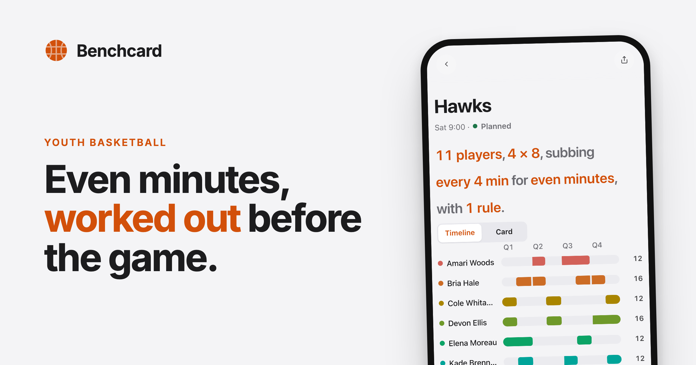

<div align="center">



# Benchcard

**Substitution rotations for a youth basketball team, printed on a card that fits in a pocket notebook.**

[**benchcard.app**](https://benchcard.app) · [What it does](#what-it-does) · [How it works](#how-it-works) · [Docs](#documentation)

[](https://github.com/kylehoehns/benchcard/actions/workflows/test.yml)
[](LICENSE)

</div>

---

## The problem

Every youth league promises equal playing time. Almost nobody delivers it,
because working it out is genuinely hard: eight to twelve kids, four quarters,
a minimum each, a cap on the stars, two who can't be on the floor together, a
ball handler who should always be out there — and one child who missed three
games and is now twenty minutes behind everyone else for the season.

Coaches do this on a spreadsheet the night before, or in their head at the
scorer's table, or not at all.

Benchcard solves it before the game and hands you a card. No signal needed, no
phone in your hand while play is live.

## What it does

**Four planning strategies:**

| | |
| --- | --- |
| **Balanced** | as close to equal as the clock allows — one click |
| **Minutes** | per-player targets on sliders, with locks |
| **Closers** | even minutes early, a group you pick finishes the game |
| **Platoon** | fixed fives alternating wholesale |

**Constraints that compose with any of them** — minimum and maximum minutes,
play-together and keep-apart pairs, "always one of these two on the floor", a
pinned opening five and last-period five, and a limit on stints in a row.

**Across the season, not just the afternoon.** Attendance is irregular, and
that is what actually creates unfairness: one kid on 27 shifts and another on
20 by February. The season ledger carries the shortfall into the next game's
targets.

**When the game breaks the plan** — foul trouble, an injury, a kid who has to
leave — re-solve from minutes actually played. The plan is not a static
artefact.

**On paper, on purpose.** The output is a 3.45 × 5in card, legible at arm's
length. A coach's hands are full and anything needing more than one tap while
play is live is dead on arrival.

## Try it

[**benchcard.app**](https://benchcard.app) — no account, no install, nothing to
accept. Add it to your Home Screen and it works with the network gone.

**Your roster never leaves your device.** Everything is stored locally in the
browser. The site counts anonymous page views and feature usage — those are
counters only, never a name, a team or an opponent — and the full version of
that claim is on the [About page](https://benchcard.app/about).

## Running it

No dependencies, no build step, no install.

```sh
git clone https://github.com/kylehoehns/benchcard
cd benchcard/app && python3 -m http.server 8201
```

From the repo root:

```sh
npm test                        # the suite — 965 tests, node --test, zero deps
npm run smoke                   # 19 browser checks: layout, a11y, card size, budgets
npm run evals                   # the agent-harness eval suite
```

## How it works

Static, client-side, no backend and no accounts. The solver, the budget, the
storage layer and the roster model are pure modules with heavy test coverage;
everything else is the interface around them.

```
app/       everything served — HTML, JS modules, sw.js, vendor/
test/      *.test.js               scripts/   CI guards, smoke, evals, bands
work/      intent.md → spec.md → plan.md, one directory per work item
evals/     agent-harness tasks     bands.yaml  control band over CI health
notes/     TICKETS.md, ROADMAP.md, DECISIONS.md
.claude/   hooks, skills, subagents
```

`app/` is the only directory that ships. It is an **allowlist** — a file is
public by being put there, which replaced a denylist that would have published
internal notes at `benchcard.app/TICKETS.md`.

## How it is built

This repo runs an [AI-native development loop](https://claude.com/blog/the-ai-native-sdlc-playbook),
and most of it is machinery rather than prose:

- **`AGENTS.md`** — the harness. The traps that have actually cost time here,
  written with the evidence that settled them.
- **`work/<slug>/`** — every item gets `intent.md` → `spec.md` → `plan.md`,
  each committed before the next begins.
- **`.claude/hooks/`** — rules that are deterministic are *enforced*, not
  documented. Blanket budget re-records, `git add -A`, and hand edits to
  generated files are denied outright.
- **`.claude/skills/`** — procedures loaded on demand, so the always-on file
  stays short.
- **`evals/`** — tasks with acceptance checks, run by `npm run evals`.
- **`REVIEW.md`** — the review policy, so severity means the same thing twice.

**The parts that are not wired up say so, in the file, and a test fails if they
stop saying it.** `bands.yaml` names which half of itself runs. The eval runner
prints `NOT RUN` for checks needing a model and counts them as neither pass nor
fail. A guard that cannot fail, a config that reads as live, and a runner that
scores unrun checks as passes are the same defect — and it is the one that has
cost this project more than any other.

## Documentation

| | |
| --- | --- |
| [`docs/architecture.md`](docs/architecture.md) | how the app is put together — the interface, game mode, the card, the solver |
| [`docs/design-decisions.md`](docs/design-decisions.md) | the calls that were made, and what they were made against |
| [`docs/operations.md`](docs/operations.md) | testing, deployment, analytics, install and sharing |
| [`AGENTS.md`](AGENTS.md) | the harness — read this before changing anything |
| [`REVIEW.md`](REVIEW.md) | the review policy |
| [`notes/ROADMAP.md`](notes/ROADMAP.md) | the research behind what this should become |

## Contributing

Read `AGENTS.md` first — it is short, and it is the accumulated list of things
that will otherwise bite you. Then `notes/TICKETS.md` for what is open.

Three rules worth knowing before you start:

1. **Never regress the card.** 3.45 × 5in, legible at arm's length. It is the
   product.
2. **Mobile first.** Verify at 390×844 before anything else. A coach uses this
   standing up, one-handed, in a gym.
3. **Verify in a real browser**, not by reading code. A grep proves a phrase is
   in a file, never that a reader sees it.

## Licence

[MIT](LICENSE). Third-party licences are listed in `app/vendor/README.md` —
Motion (MIT), Inter (SIL OFL 1.1) and Lucide (ISC).
